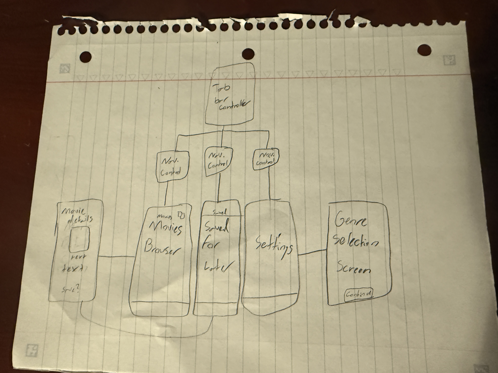

iOS101 Final
===

# MovieNight

## Table of Contents

1. [Overview](#Overview)
2. [Product Spec](#Product-Spec)
3. [Wireframes](#Wireframes)
4. [Networking](#Networking)

## Overview

An Xcode project that gives the user a list of generated movies based on their prefered genres.

### Description

An application that allows the user to select their favorite genres when first entering the app, and keeping that data while they come and go. It selects movies from the TMDb API based on the indicated genre(s) and suggests the user movies they might like. The user can look through their saved movies, along with delete and add them at their will. In the main movies tab is a random button, which will give the user a random movie based on their liked genres. It lets the user add the movie if they want to, or suggest a new one. The user can change their genres in the settings tab, along with clear all app data.

### App Evaluation

[Evaluation of your app across the following attributes]

- **Mobile:** The app creates a smooth and personal experience. It saves your favorite movie genres based on what you pick, along with an added "save for later" list. These things persist, even if the app closes. It's built to feel fast and responsive with a simple user interface.
- **Story:** Imagine you just got food from your local fast food locations, got home, and felt like watching something. You just finished your show and don't know what to watch next, which is where this app comes in handy. It'll give you a movie/tv show based on what you like, removing the need to scroll to find something.
- **Market:** The market is huge. Basically anyone who watches movies or tv shows could use this app, which is a massive chunk of the population.
- **Habit:** The app isn't designed to be one you'd "constantly open". It's meant to be opened whenever you might not know what you want to watch, which for most isn't that often. The app targets people who might want a quick, personalized recommendation without having to think too much
- **Scope:** The app isn't too hard nor to easy, and perfect as a class project. It uses what we've been taught so far, along with learning some new things, and delivers the perfect project for an introductory class. It's something that sparks my interest, as it's something I can also relate to.

## Product Spec

### 1. User Stories (Required and Optional)

**Required Must-have Stories**

- [x] Persistant data when app is closed and reopened.
- [x] Selectable genres, with movie suggestions based on those.
- [x] Movie browser to look through movies.
- [x] Save for later tab to save and delete possible watches.
- [x] Settings tab to allow the user to change liked genres.

**Optional Nice-to-have Stories**

- [x] Suggest a random movie based on indicated liked genres.
- [x] A "Delete all" button to remove all data.

### 2. Screen Archetypes

- [x] Genre Selection Screen
* Selectable genres, with movie suggestions based on those.
- [x] Movie Browser
* Movie browser to look through movies.
- [x] Save for Later
* Save for later tab to save and delete possible watches.
- [x] Settings Tab
* Persistant data when app is closed and reopened.
* Settings tab to allow the user to change liked genres.

### 3. Navigation

**Tab Navigation** (Tab to Screen)

* Movies
* Save for Later
* Settings

**Flow Navigation** (Screen to Screen)

- [x] Genre Selection
* Select liked genres, and press continue when finished.
- [x] Movies Browser
* Click on movies to bring up a full screen easier to read description, and either click save for later in that bigger screen or swipe left on the movie in the movie browser to save a movie.
- [x] Save for Later
* Swipe right to delete movies off the list.
* Click on the movie to see a bigger version of it.
- [x] Settings
* Change liked genres.
* Clear all app data.

## Wireframes

[Add picture of your hand sketched wireframes in this section]

### Networking

- Pulls data from The Movie Database (TMDb)
